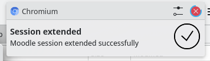

# Moodle Session Extender

Tired of always re-logging in to moodle? Extend your moodle session lifetime!

## How it works

Apparently moodle has an API method to extend the lifetime of a session. If you just call this API regularly your session will never expire.

This repo features a server that does exactly that.

As a convenience feature it also features a browser extension that sends the sessions to server for continuous extension

## Installation

In case of firefox, download extension from [releases](https://github.com/DCNick3/moodle-session-ext/releases/latest) page and install it into your browser. The extension provided in the releases is signed by Mozilla, so you can install it easily.

In case of chromium-based browsers, you can install it from [Chrome Web Store](https://chromewebstore.google.com/detail/moodle-session-extender/jlkihkgdajcdpbnkdlamhiggdggnjmil). Alternatively, you can enable the so-called "developer mode" and load the corresponding file from the [releases](https://github.com/DCNick3/moodle-session-ext/releases/latest).

## Usage

Navigate to your moodle page & log in. The extension should capture the moodle session cookie and send it to the server. A notification should appear notifying you whether the session was extended successfully or not:

Note that the extension published in releases and chrome web store only works with the Innopolis University moodle instance. Making it work with other moodle instances will require both a custom extension build and specially-deployed server (see below).

## Your own server

There are two cases for when you want to run a custom server:
1. innopolis university moodle, but your own server (because you don't want to send all your sessions to me or smth)
2. another moodle instance and your own server (my server only works with innopolis moodle)

### 1. Innopolis Moodle, Own server

To run a custom server against innopolis university moodle you would need:
1. deploy the docker container with the server software (build it with the provided `Dockerfile`, use `docker-compose.yaml` or get it from `ghcr.io/dcnick3/moodle-session-ext:ref-cefae23f6dc152f5b32eb558ab547985ae7daa98`)
2. make sure it's HTTP API on port `8080` is exposed publicly as an HTTPS server. You would need to use a reverse proxy like traefik or nginx for this.

Then you can just point the extension to your own server by putting its https URL to settings.

### 2. Another Moodle, Own server

To run it against another moodle instance you would need to take some additional steps.

First of all, you would need to build your own web extensions. To do this:
1. Change all the instances of `https://moodle.innopolis.university` to your own moodle instance URL in `webextension/source/mv2/manifest.json`, webextension/source/mv3/manifest.json` and `webextension/source/background.js`.
2. Put your own server URL into `webextension/source/options-storage.js`
3. Build your own web extension by running `yarn prepublish` in `webextension` directory

After this you will have `firefox.zip` and `chrome.zip` files that you can load into the corresponding browser families. Firefox allows only temporary loads (so-called debug add-ons), you would need to [sign it with mozilla](https://extensionworkshop.com/documentation/publish/signing-and-distribution-overview/) if you want to keep it permamently loaded (choose the unlisted option).

As for the server, you would also need to change the moodle URL here by editing `config.prod.yml` and build your own docker image with the provided `Dockerfile`. You can probably also get away with replacing the config by starting `FROM ghcr.io/dcnick3/moodle-session-ext:ref-cefae23f6dc152f5b32eb558ab547985ae7daa98`.

Otherwise, the steps are the same: get it running somewhere and make sure there's a public HTTPS endpoint the server is available at. As an added bonus, as you have built your own extension, you don't need to change the server URL in the extension settings.
